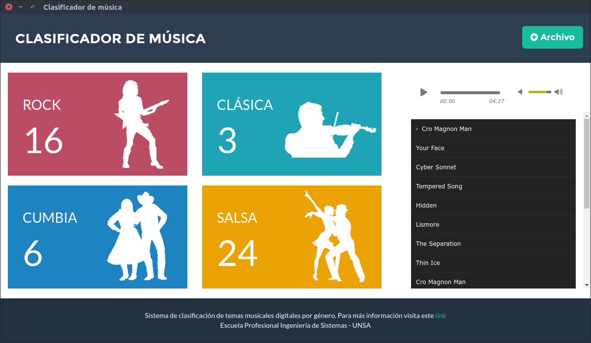

# Clasificador de musica por género

Módulo Servidor: Sistema de clasificacion de temas musicales en 4 géneros (rock, música clásica, cumbia y salsa) utilizando algoritmo NEAT.



## Requerimientos

Deben estar definidos en el PATH del sistema

- npm (Node Package Manager) 3.x
- NodeJS 5.x
- Python 2.x

## Instalacion

- Instalar dependencias globables como superusuario (administrador)

```bash
npm install -g bower
npm install -g gulp
```

- Instalar dependencias locales

```bash
npm install
bower install
```

- Instalar dependencias de Python
```bash
pip2 install -r pybackend/requirements.txt
```

## Ejecucion - Development

```bash
gulp copy
npm start
```

Abrir en un navegador localhost:8051

## Sitio Web de prueba

Disponible [aquí](http://clasificador-yga.rhcloud.com)

## Verificar

- Version de Python debe ser 2.x
```bash
python --version
```

- Pip debe ser para Python 2.x
```bash
pip --version
```
```bash
pip2 --version
```
