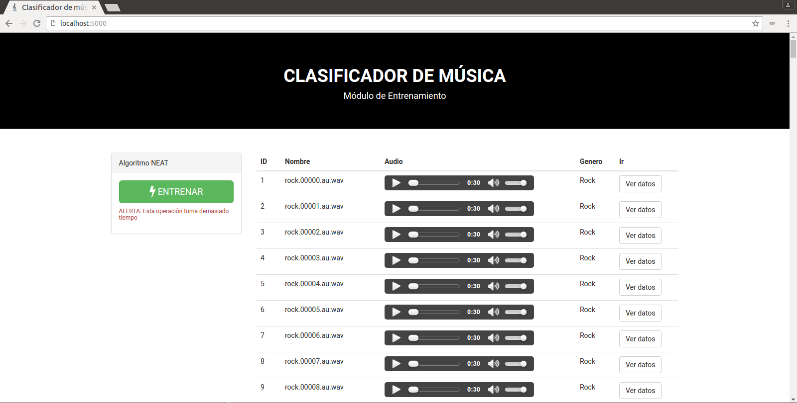

# Clasificador de musica por género

Módulo Servidor: Sistema de clasificacion de temas musicales en 4 géneros (rock, música clásica, cumbia y salsa) utilizando algoritmo de detección del ritmo.



## Requerimientos

Deben estar definidos en el PATH del sistema

- npm (Node Package Manager) 3.x
- NodeJS 5.x
- Python 2.x
- MySQL
```bash
sudo apt-get install libmysqlclient-dev
```

## Instalacion

- Instalar dependencias globables como superusuario (administrador)
```bash
npm install -g bower
npm install -g gulp
```

- Instalar dependencias locales
```bash
npm install
bower install
```

- Instalar dependencias de Python
```bash
pip install -r requirements.txt
```

- Crear una base de datos 'clasificador' y ejecutar el script schema.sql

- Modificar el archivo settings.json

- Copiar las librerias a la carpeta static
```bash
gulp copy
```

- Crear un enlace simbólico (symlink) de la carpeta 'data' en 'app/static/media'
Linux:
```bash
ln -sf <ruta_absoluta_app/data> <ruta_absoluta_app/static/media>
```
Windows:
```bash
MKLINK /j <ruta_absoluta_app/data> <ruta_absoluta_app/static/media>
```

## Ejecucion - Development

- Ejecutar
```bash
npm start
```

- Abrir en un navegador localhost:8051

## Sitio Web de prueba

Disponible [aquí](http://clasificador-yga.rhcloud.com)

## Verificar

- Version de Python debe ser 2.x
```bash
python --version
```

- Pip debe ser para Python 2.x
```bash
pip --version
```
```bash
pip2 --version
```
